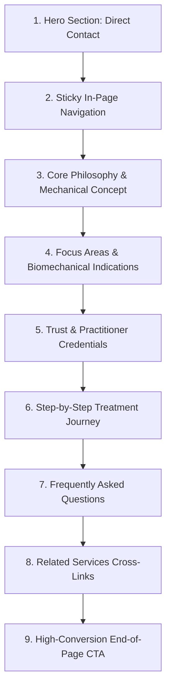

# IMPLEMENTATION_SERVICES_DESIGN: Shared Design System & Page Templates

This implementation plan defines the layout structure, visual hierarchy, and shared design system for the four service pages:
1. **Μέθοδος McKenzie**
2. **TECAR Therapy**
3. **Θεραπεία & Πρόληψη Σπονδυλικού Πόνου**
4. **Θεραπευτική Άσκηση**

All pages share a cohesive, premium design language customized for clinical authority and physical rehabilitation. No copywriting will be modified during this stage; this plan governs layout structures, visual parameters, and CSS styling tokens only.

---

## 1. Frontend Tech Stack Confirmation

The implementation targets the existing website architecture:
*   **Framework**: React (v18+) with TypeScript
*   **Styling**: Tailwind CSS (v3+) for utility styling and layout structures
*   **Animations**: Framer Motion (v11+) for dynamic transitions, dropdown lists, scroll interactions, and accordion heights
*   **Icons**: Lucide React for consistent vector symbols

---

## 2. Shared Design System (Physiotherapy-Specific)

To prevent the pages from looking like a generic SaaS or dental clinic site, the design language is explicitly tailored around **anatomy, physics, biomechanical movement, and thermal energy**:

### A. Color Palette
The color scheme reflects medical professionalism, therapeutic energy, and safety:
*   **Primary Brand Color**: `#004aad` (Royal Ocean Blue) - Represents trust, medical authority, and deep core stability.
*   **Secondary/Accent Color**: `#0082c8` (Calming Teal Blue) - Represents movement, energy flow, and cellular activation.
*   **Neutral Dark**: `#1e293b` (Slate-800) - For clear body copy and technical text readability.
*   **Neutral Light Background**: `#f8fafc` (Slate-50) - Alternating layout background.
*   **Card Background**: `#ffffff` (Pure White) with light borders (`border-slate-100`) and soft shadows (`shadow-sm` transitioning to `shadow-md`).
*   **Active Indicator / Highlight**: `#e0f2fe` (Sky-100) - Soft blue background for active navigations or highlights.

### B. Typography & Hierarchy (Zona Pro)
*   **Page Title (Hero)**: `text-4xl md:text-5xl font-extrabold tracking-tight text-slate-900`
*   **Section Headers**: `text-2xl md:text-3xl font-bold text-[#004aad]`
*   **Card Titles**: `text-lg md:text-xl font-bold text-slate-800`
*   **Body Copy**: `text-base md:text-lg text-slate-600 leading-relaxed font-light`
*   **Subnav Links**: `text-sm font-semibold tracking-wide uppercase`

### C. Physiotherapy-Specific Visual Design Tokens
Instead of generic stock imagery and standard abstract SaaS chips, the following specific visual language will be applied:

1.  **Biomechanical Line Art & Vectors**: Standard icons are supported by soft biomechanical/anatomical vector background overlays (e.g. joint rotation arcs, load distribution lines, spinal curves).
2.  **Movement & Direction Indicators**: Graphic elements include subtle direction arrows or range-of-motion (ROM) arcs to visually represent physical action and directional preference (critical for McKenzie & Therapeutic Exercise).
3.  **Energy & Cellular Warmth Indicators (for TECAR)**: Utilizing soft circular radial gradients (e.g., `bg-gradient-to-r from-orange-500/10 via-blue-500/5 to-transparent`) to symbolize deep tissue thermal therapy and cellular energy activation.
4.  **Photography Direction**: High-contrast, hands-on clinical photography. Visuals will showcase precise therapist hand placements, manual mobilization contacts, active exercise execution, or device electrode interfaces (TECAR) rather than generic stock smiling models.

---

## 3. Shared Page Layout Structure (Template)

Each of the 4 service pages follows a consistent anatomical section flow:

### Section-by-Section Visual Rules

#### 1. Hero Section (Anatomy & Action)
*   **Layout**: Split 2-column container (`grid-cols-1 lg:grid-cols-12`).
    *   **Left Column (7 cols)**: Path breadcrumb, page title, brief introductory description, and action buttons ("Κλείστε Ραντεβού" / "Διαβάστε Περισσότερα").
    *   **Right Column (5 cols)**: Close-up action photograph of the specific therapy in practice (e.g., McKenzie lumbar extension check, TECAR electrode contact, or resistance band exercise) in a rounded container with a floating highlight badge summarizing its primary mechanism (e.g., "Μηχανική Διάγνωση").

#### 2. Sticky In-Page Navigation
*   **Layout**: Thin horizontal pill-shaped bar docked below the header on scroll.
*   **Behavior**: Sticky (`sticky top-[80px]`), utilizing Framer Motion or scroll spy to highlight active anchors.
*   **Pills/Links**:
    1. *Η Φιλοσοφία* (Philosophy)
    2. *Ενδείξεις* (Indications)
    3. *Η Διαδικασία* (Process)
    4. *Συχνές Ερωτήσεις* (FAQs)

#### 3. Core Philosophy & Mechanical Concept (Plain Text & Diagram)
*   **Layout**: Asymmetric layout with large narrative body copy and a stylized technical graphic/diagram mapping the therapy's mechanical rationale (e.g., mechanical load shift, thermal tissue response, or movement plane axis).

#### 4. Focus Areas & Biomechanical Indications (Interactive Cards)
*   **Layout**: Grid array (`grid-cols-1 md:grid-cols-2 lg:grid-cols-3`).
*   **Visual Treatment**: Cards with biomechanical markers (e.g., joint loading points or spinal segment markers) instead of standard bullet lists. Hovering lifts the card and activates a subtle direction arrow indicating relief or movement progression.

#### 5. Trust & Practitioner Credentials (New)
*   **Layout**: Split 2-column layout to establish clinical reassurance.
    *   **Left**: High-quality portrait of the physical therapist/practitioner alongside specialized certification seals/badges (e.g. Certified McKenzie Practitioner, advanced sports injury training credentials).
    *   **Right**: Short bio, specialized expertise statement, and a signed quotes block emphasizing the individualized, evidence-based approach to patient care.

#### 6. Step-by-Step Treatment Journey (Numbered Sequence)
*   **Visual Treatment**: Clean progression pathway showing clinical phases (e.g. 1. Αξιολόγηση -> 2. Εξατομικευμένο Πλάνο -> 3. Ενεργός Αποκατάσταση). Utilizes a thin connecting vector line representing a patient recovery curve.

#### 7. Frequently Asked Questions (FAQ Accordions)
*   **Visual Treatment**: Custom panels built with Framer Motion. Smooth height expansion and rotation of active indicators. Active questions transition to a subtle light-blue background (`bg-blue-50/50`) to emphasize selection.

#### 8. Related Services Cross-Links (New)
*   **Layout**: 3-column horizontal grid placed before the final CTA.
*   **Purpose**: Encourages users to read about related methods and builds high-quality internal SEO paths.
*   **Visual**: Small-format preview cards showing titles, minimal outline biomechanical symbols, and brief descriptions of the other 3 service pages.

#### 9. High-Conversion End-of-Page CTA
*   **Visual Treatment**: Full-width premium background block utilizing a soft gradient (`from-slate-50 to-blue-50/50`).
*   **Components**: Direct title, text, and two buttons: "Κλείστε Ραντεβού Online" and "Επικοινωνήστε Τηλεφωνικώς".

---

## 4. Verification Plan
1.  **Uniformity Audit**: Open all 4 pages side-by-side to verify consistent margins, button alignments, font weights, and color utilization.
2.  **Navigation Flow Check**: Verify that the sticky in-page anchor navigation operates correctly, changes active states during scroll, and scrolls smoothly.
3.  **Responsive Check**: Test grid shifts from 3 columns (desktop) to 1 column (mobile), verifying image and card sizing on simulated phone views.
